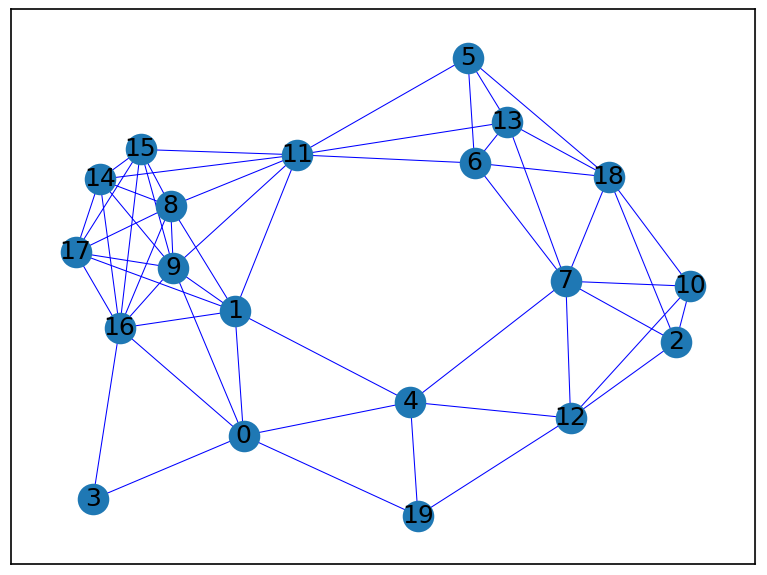

# Завдання 1

## Побудова графу та аналіз його основних характеристик

Кількість вершин 20

Кількість ребер 56

Граф сполучений (зв’язний) True

Середній найкоротший шлях 2.194736842105263

Вершини [9, 11, 16] мають найбільший ступінь 8

Вершини [9, 11, 16] мають найбільший ступінь центральності 0.42105263157894735

Вершина 1 має найбільший ступінь близькості 0.5588235294117647

Вершина 11 має найбільший ступінь посередництва 0.25732351154177785

# Завдання 2

## Порівняння алгоритмів DFS і BFS для знаходження шляхів у графі

### Шляхи обходу графу для кожного алгоритма

DFS

0 1 4 7 2 10 12 19 18 5 6 11 8 9 14 15 16 3 17 13

BFS

0 1 3 4 9 16 19 8 11 17 12 7 14 15 5 6 13 2 10 18

### Висновки

Як бачимо, алгоритм DFS робить обхід графу у глибину, тобто він отримує список сусідів для поточної вершини, вибирає першого сусіда "відвідує" його і рекурсивно (в данному випадку використовуємо рекурсію) робить цього сусіда поточним і отримує список його сусідів. Це продовжується доки у поточної вершини не буде сусідів, або всі сусіди були вже відвідані. Далі повертається на один рівень і відвідує наступного сусіда, якщо ще є невідвідані.

Для алгоритму BFS послідовність трохи інша. Спочатку "відвідуються" всі сусіди поточної вершини, а дали ітеративно (в данному випадку використовуємо ітеративний підхід) "відвідуються" сусіди сусідів. Так продовжується доки у поточної вершини не буде сусідів, або всі сусіди були вже відвідані. На цьому алгоритм завершується.

Для обох алгоритмів справедливим є те, що послідовність вибирання сусіда не є сталою, оскільки при отриманні сусідів для поточної вершини ми отримуємо словник, звідки формуемо список сусідів, а при такій операції словник не гарантує ту саму послідовність сусідів у списку. Тому при багатократному запуску алгоритмів послідовність відвіданих вершин може змінуватись на рівні сусідів, але не на рівні кроків пошуку, описаних вище.

# Завдання 3

## Алгоритм Дейкстри для знаходження найкоротшого шляху

(0, 0)

(1, 0.14486026266157298)

(2, 0.7855964868985004)

(3, 0.36949038007118)

(4, 0.3106355421889741)

(5, 0.7997433485032678)

(6, 0.6722240546117432)

(7, 0.6994683357610977)

(8, 0.5156144129156646)

(9, 0.3466502797826158)

(10, 0.7918969626740548)

(11, 0.5333469440672275)

(12, 0.518229989696404)

(13, 0.6930951324906266)

(14, 0.5858135812025425)

(15, 0.6089594839923196)

(16, 0.30088703050502025)

(17, 0.4444280797455381)

(18, 0.945089060642774)

(19, 0.34276908982925575)

Найдовший шлях з вершини 0 до вершини 18, що складає 0.945089060642774